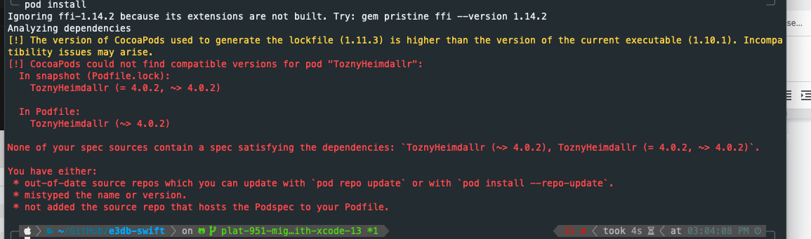
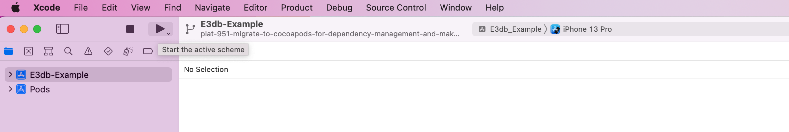
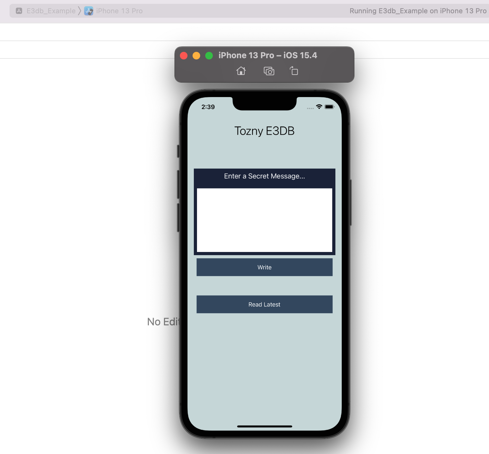

# Development

## Testing

### Configuration

Before running the tests you will want to add configuration for a valid Tozny endpoint to test against (e.g. Tozny Platform running locally [exposed over the internet with ngrok](https://ngrok.com), or the Tozny Development, Staging, or Production SaaS environments).

Specifically, to run the `IntegrationTests.swift` [tests](./Example/IntegrationTests.swfit) (covering TozStore APIs for reading, writing, sharing, searching, and deleting encrypted records) you will need to add a value for `apiUrl` and `token` for a Tozny environment to test against and a valid registration token for that environment.

```swift
    static let apiUrl: String? = "http://51a0fe63a6b4.ngrok.io/"
    static let token  = "41a0041e6685d0f49e95235e68ac6180b441e3fbefaef7357ebc29b050976d12"
```

**Note: Currently all the tests in the above file related to working with Files fail**

To run the [integration tests covering TozID APIs](./Example/IdentityTests.swfit) for registering and logging in Identities, and TozStore features such as reading and writing notes you will need to add values for a valid Identity, a TozID login Application for a realm, and a registration token

```swift
class IdentityTests: XCTestCase, TestUtils {

    var config: Config!
    var idConfig: IdentityConfig!
    var identity: PartialIdentity!
    var validApplication: Application!
    var validUsername: String!
    var validPass: String!
    var regToken: String!

  	override func setUp() {
        super.setUp()
        // Initialize valid values for all above config
        self.regToken = "41a0041e6685d0f49e95235e68ac6180b441e3fbefaef7357ebc29b050976d12"
        self.validApplication = Application.init(apiUrl: "http://4d487b296be0.ngrok.io", appName: "account", realmName: "local", brokerTargetUrl: "http://id.tozny.com/local/recover")
    }

	// ...rest of class omitted
}
```

**Note: Currently all the tests in the above file that call an API fail**

**Note: Due to the `ResponseDetective` dependency used in the tests for the SDK failing to build in Xcode 13, it is not currently possible to run test files.**
**The example application does build and run in simulators tested up to and including iPhone 13 Pro Max. This example application verifies the functionality of writing and reading records to TozStore.**

## Example App

### Configuration

Before running the Example app you will want to add configuration for a valid Tozny Client registration token for the [Tozny Production environment](https://dashboard.tozny.com) in the [entry point for the app](./Example/E3db-Example/ViewController.swift)

```swift
// Create an account and generate
// a client token from https://dashboard.tozny.com
private let e3dbToken = "259918a1804c89f4acd10b134810442284e4b2d93776c5a7a1c8934e14113a81"
```

## Building (Release 4.2.2)
Due to difficulties using Carthage as a package manager for the project, for release 4.2.2 the SDK has transitioned to using [Cocoapods](https://cocoapods.org/) for both the `E3db` SDK and `E3db-example` test application projects in this repository. The current build instructions for version 4.2.2 and beyond are detailed here.

1. `cd e3db-swift`
2. `pod install` - The SDK dependencies are downloaded and built.
3. `cd Example`
4. `pod install` - The example application's dependencies are downloaded and built

If `pod install` fails due to an error such as:



To fix this run:
```
pod install --repo update
```

What happened is that `pod install` references specs in the local `~/.cocoapods/repos` directory when installing dependencies. The `--repo-update` will update these references so that the latest pod versions can be found. The above command will update the repo specs, and run `pod install`.

## Running (Release 4.2.2)
After following the build steps in the [Building](#Building) section, the example application can be ran to test some functionality of the SDK.

1. Open the `E3db-example.xcworkspace` file in Xcode
2. Choose the desired simulator or connected device for which to run the example application on.
    

3. Run the `E3db-example` target in Xcode to start the simulated or connected device, and run the example application.
    

## Legacy Building (Releases <= 4.2.1)

**Note: Releases <=4.2.1 are not compatible with Xcode 13. The build instructions below will likely fail if attempted in any Xcode version other than Xcode 12 and below.**

The `e3db-swift` repository uses two package managers: [Carthage](https://formulae.brew.sh/formula/carthage#default) for `E3db` and [Cocoapods](https://cocoapods.org/) for `Example`. Follow the links above to install both tools, then follow the steps below to build the projects' dependencies:

1. Run the `carthage update --use-xcframeworks --platform iOS --cache-builds` command from the root of the directory which contains the `Cartfile`. This will build dependencies for the `E3db` target.

2. (Optional) If you previously installed dependencies you may need to migrate to using XCFrameworks. Follow the steps [here](https://github.com/Carthage/Carthage#migrating-a-project-from-framework-bundles-to-xcframeworks) in order to complete the migration step, if necessary.

3. **Note that this step may not be necessary, but it is worth checking to see if the XCFramework are linked in Xcode before continuing**. Follow step 6 in the [Carthage Quick Start](https://github.com/Carthage/Carthage#quick-start) guide to move the XCFrameworks bundles into the project in Xcode. Below are two images showing where the XCFrameworks should be moved from the Finder to Xcode:

    Drag the `.xcframework` bundles from Finder
    

    To the `Link Binaries With Libraries` section of the `E3db` target's Build Phases. Open `E3db.xcodeproj` in Xcode to view this menu:
    


4. Run `pod install` from the `Example/` directory to install necessary dependencies for the `E3db-Example` target.

5. The `E3db-example` target can now be opened in Xcode by opening the `E3db-example.xcworkspace` in `Example/` directory, and the `E3db` target can be opened by opening `E3db.xcodeproj` in the root of the repository.

## Release

To release a new version make sure that all added files are within the pod defined source folders

From E3db.podspec
```
s.version          = '4.1.0-alpha.1' // edit this version to match the eventual release

s.source_files = 'E3db/Classes/**/*'
```

Verify that the pod can be compiled with
```
pod lib lint
```

The above command currently fails with

```

 -> E3db (4.2.2)
    - NOTE  | [E3db/Core] xcodebuild:  note: Using new build system
    - NOTE  | [E3db/Core] xcodebuild:  note: Using codesigning identity override: -
    - NOTE  | [E3db/Core] xcodebuild:  note: Build preparation complete
    - NOTE  | [E3db/Core] xcodebuild:  note: Planning
    - NOTE  | [E3db/Core] xcodebuild:  note: Building targets in dependency order
    - NOTE  | [E3db/Core] xcodebuild:  Pods.xcodeproj: warning: The iOS Simulator deployment target 'IPHONEOS_DEPLOYMENT_TARGET' is set to 8.0, but the range of supported deployment target versions is 9.0 to 15.4.99. (in target 'ToznySwish' from project 'Pods')
    - WARN  | xcodebuild:  /Users/mrhea/code/e3db-swift/E3db/Classes/Application.swift:33:26: warning: enum case 'success' has one associated value that is a tuple of 2 elements
    - NOTE  | xcodebuild:  <unknown>:0: note: 'success' declared here
    - WARN  | xcodebuild:  /Users/mrhea/code/e3db-swift/E3db/Classes/Application.swift:88:80: warning: expression implicitly coerced from '[String : String]?' to 'Any'
    - NOTE  | xcodebuild:  /Users/mrhea/code/e3db-swift/E3db/Classes/Application.swift:88:80: note: provide a default value to avoid this warning
    - NOTE  | xcodebuild:  /Users/mrhea/code/e3db-swift/E3db/Classes/Application.swift:88:80: note: force-unwrap the value to avoid this warning
    - NOTE  | xcodebuild:  /Users/mrhea/code/e3db-swift/E3db/Classes/Application.swift:88:80: note: explicitly cast to 'Any' with 'as Any' to silence this warning
    - WARN  | xcodebuild:  /Users/mrhea/code/e3db-swift/E3db/Classes/Application.swift:102:35: warning: result of call to 'wait(timeout:)' is unused
    - WARN  | xcodebuild:  /Users/mrhea/code/e3db-swift/E3db/Classes/Application.swift:125:31: warning: result of call to 'wait(timeout:)' is unused
    - WARN  | xcodebuild:  /Users/mrhea/code/e3db-swift/E3db/Classes/Application.swift:227:66: warning: 'as' test is always true
    - WARN  | xcodebuild:  /Users/mrhea/code/e3db-swift/E3db/Classes/Authenticator.swift:103:22: warning: enum case 'success' has one associated value that is a tuple of 2 elements
    - WARN  | xcodebuild:  /Users/mrhea/code/e3db-swift/E3db/Classes/Crypto.swift:256:13: warning: variable 'encryptedNote' was never mutated; consider changing to 'let' constant
    - WARN  | xcodebuild:  /Users/mrhea/code/e3db-swift/E3db/Classes/Crypto.swift:278:13: warning: variable 'unencryptedNote' was never mutated; consider changing to 'let' constant
    - WARN  | xcodebuild:  /Users/mrhea/code/e3db-swift/E3db/Classes/Crypto.swift:513:13: warning: variable 'username' was never mutated; consider changing to 'let' constant
    - WARN  | xcodebuild:  /Users/mrhea/code/e3db-swift/E3db/Classes/Crypto.swift:561:13: warning: variable 'saltBytes' was never mutated; consider changing to 'let' constant
    - WARN  | xcodebuild:  /Users/mrhea/code/e3db-swift/E3db/Classes/Crypto.swift:573:13: warning: constant 'status' inferred to have type 'Void', which may be unexpected
    - NOTE  | xcodebuild:  /Users/mrhea/code/e3db-swift/E3db/Classes/Crypto.swift:573:13: note: add an explicit type annotation to silence this warning
    - WARN  | xcodebuild:  /Users/mrhea/code/e3db-swift/E3db/Classes/Crypto.swift:576:17: warning: constant 'passwordBuffer' inferred to have type 'Void', which may be unexpected
    - NOTE  | xcodebuild:  /Users/mrhea/code/e3db-swift/E3db/Classes/Crypto.swift:576:17: note: add an explicit type annotation to silence this warning
    - WARN  | xcodebuild:  /Users/mrhea/code/e3db-swift/E3db/Classes/Crypto.swift:582:25: warning: initialization of 'UnsafePointer<UInt8>' results in a dangling pointer
    - NOTE  | xcodebuild:  /Users/mrhea/code/e3db-swift/E3db/Classes/Crypto.swift:582:46: note: implicit argument conversion from '[UInt8]' to 'UnsafePointer<UInt8>' produces a pointer valid only for the duration of the call to 'init(_:)'
    - NOTE  | xcodebuild:  /Users/mrhea/code/e3db-swift/E3db/Classes/Crypto.swift:582:46: note: use the 'withUnsafeBufferPointer' method on Array in order to explicitly convert argument to buffer pointer valid for a defined scope
    - WARN  | xcodebuild:  /Users/mrhea/code/e3db-swift/E3db/Classes/Crypto.swift:576:51: warning: 'withUnsafeBytes' is deprecated: use `withUnsafeBytes<R>(_: (UnsafeRawBufferPointer) throws -> R) rethrows -> R` instead
    - WARN  | xcodebuild:  /Users/mrhea/code/e3db-swift/E3db/Classes/Crypto.swift:573:46: warning: 'withUnsafeMutableBytes' is deprecated: use `withUnsafeMutableBytes<R>(_: (UnsafeMutableRawBufferPointer) throws -> R) rethrows -> R` instead
    - WARN  | xcodebuild:  /Users/mrhea/code/e3db-swift/E3db/Classes/Crypto.swift:573:13: warning: initialization of immutable value 'status' was never used; consider replacing with assignment to '_' or removing it
    - WARN  | xcodebuild:  /Users/mrhea/code/e3db-swift/E3db/Classes/Crypto.swift:576:17: warning: initialization of immutable value 'passwordBuffer' was never used; consider replacing with assignment to '_' or removing it
    - WARN  | xcodebuild:  /Users/mrhea/code/e3db-swift/E3db/Classes/Extensions.swift:154:13: warning: 'withUnsafeBytes' is deprecated: use `withUnsafeBytes<R>(_: (UnsafeRawBufferPointer) throws -> R) rethrows -> R` instead
    - NOTE  | [E3db/Core] xcodebuild:  Pods.xcodeproj: warning: The iOS Simulator deployment target 'IPHONEOS_DEPLOYMENT_TARGET' is set to 8.0, but the range of supported deployment target versions is 9.0 to 15.4.99. (in target 'Result' from project 'Pods')

[!] E3db did not pass validation, due to 18 warnings (but you can use `--allow-warnings` to ignore them).
You can use the `--no-clean` option to inspect any issue.
```

It's uncertain at this time whether the lint warnings should be resolved, and they do not prevent new versions of Swift SDK from being picked up by downstream consumers such as the [Tozny Flutter Plugin](https://github.com/tozny/flutter_plugin)

The `E3db` podspec passes validation when the `--allow-warnings` flag is used:
```
pod lib lint --allow-warnings
```

Tag the release and push the tags to github
```
git tag '4.1.0-alpha.1'
git push --tags
```

Under repo > releases > select `Draft a new release` for the tag you're pushing.

### Cocoapod Publishing
Tozny currently does not publish a Pod to Cocoapod's registry, but given that spec validation does succeed with `pod lib lint --allow-warnings`, this is an option. If publishing a Pod the registry is desired, follow the steps below and reference the [Cocoapod documentation](https://guides.cocoapods.org/making/getting-setup-with-trunk.html) as needed.

1. `pod trunk register [POD_OWNER_EMAIL_ADDRESS] '[POD_OWNER_NAME]'`
2. `pod trunk push [POD_NAME.podspec]`
