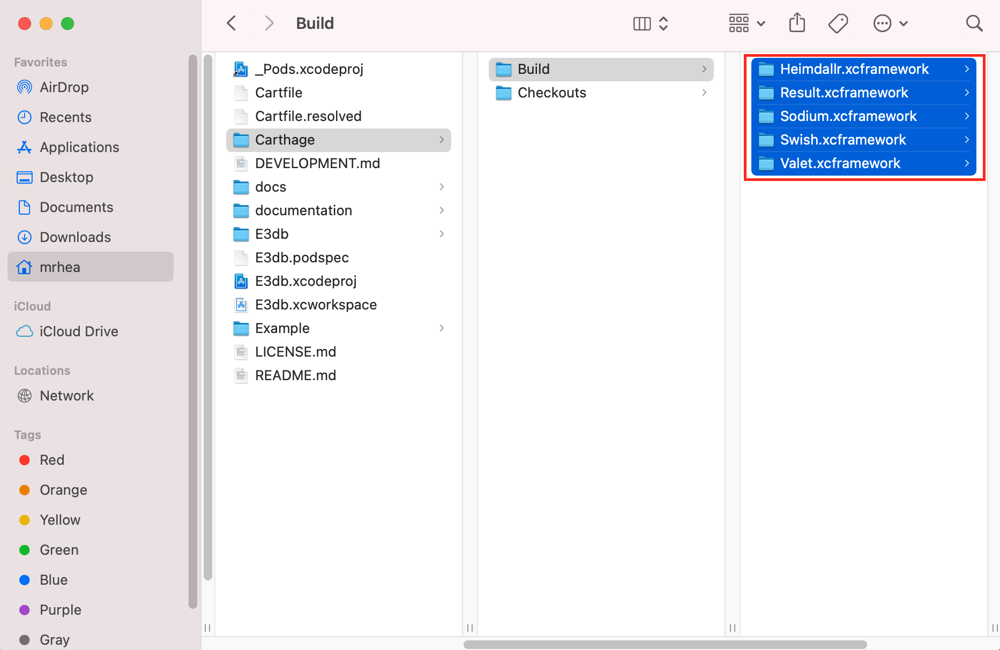
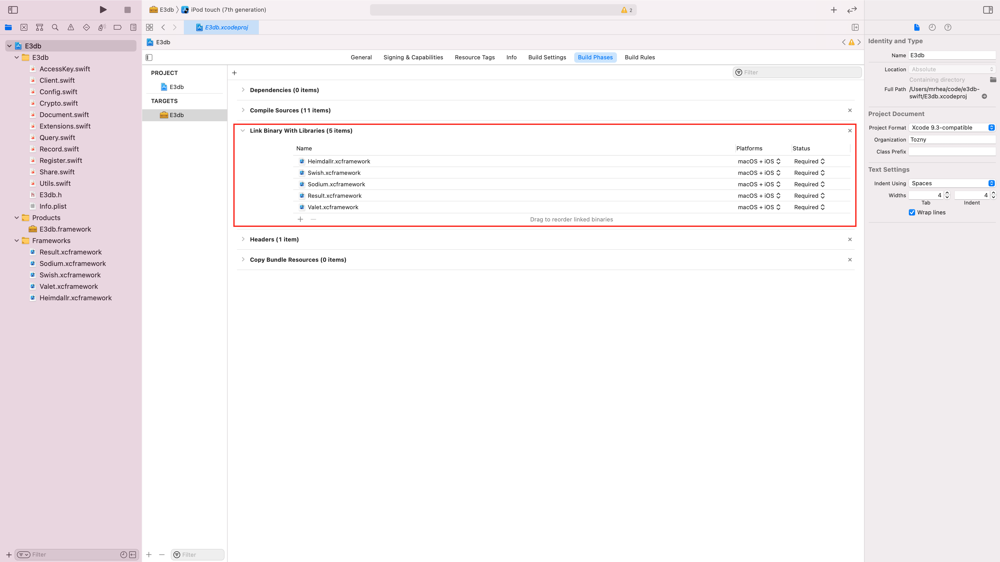

# Development

## Testing

### Configuration

Before running the tests you will want to add configuration for a valid Tozny endpoint to test against (e.g. Tozny Platform running locally [exposed over the internet with ngrok](https://ngrok.com), or the Tozny Development, Staging, or Production SaaS environments).

Specifically, to run the `IntegrationTests.swift` [tests](./Example/IntegrationTests.swfit) (covering TozStore APIs for reading, writing, sharing, searching, and deleting encrypted records) you will need to add a value for `apiUrl` and `token` for a Tozny environment to test against and a valid registration token for that environment.

```swift
    static let apiUrl: String? = "http://51a0fe63a6b4.ngrok.io/"
    static let token  = "41a0041e6685d0f49e95235e68ac6180b441e3fbefaef7357ebc29b050976d12"
```

**Note: Currently all the tests in the above file related to working with Files fail**

To run the [integration tests covering TozID APIs](./Example/IdentityTests.swfit) for registering and logging in Identities, and TozStore features such as reading and writing notes you will need to add values for a valid Identity, a TozID login Application for a realm, and a registration token

```swift
class IdentityTests: XCTestCase, TestUtils {

    var config: Config!
    var idConfig: IdentityConfig!
    var identity: PartialIdentity!
    var validApplication: Application!
    var validUsername: String!
    var validPass: String!
    var regToken: String!

  	override func setUp() {
        super.setUp()
        // Initialize valid values for all above config
        self.regToken = "41a0041e6685d0f49e95235e68ac6180b441e3fbefaef7357ebc29b050976d12"
        self.validApplication = Application.init(apiUrl: "http://4d487b296be0.ngrok.io", appName: "account", realmName: "local", brokerTargetUrl: "http://id.tozny.com/local/recover")
    }

	// ...rest of class omitted
}
```

**Note: Currently all the tests in the above file that call an API fail**


## Example App

### Configuration

Before running the Example app you will want to add configuration for a valid Tozny Client registration token for the [Tozny Production environment](https://dashboard.tozny.com) in the [entry point for the app](./Example/E3db-Example/ViewController.swift)

```swift
// Create an account and generate
// a client token from https://dashboard.tozny.com
private let e3dbToken = "259918a1804c89f4acd10b134810442284e4b2d93776c5a7a1c8934e14113a81"
```

## Building

The `e3db-swift` repository uses two package managers: [Carthage](https://formulae.brew.sh/formula/carthage#default) for `E3db` and [Cocoapods](https://cocoapods.org/) for `Example`. Follow the links above to install both tools, then follow the steps below to build the projects' dependencies:

1. Run the `carthage update --use-xcframeworks --platform iOS --cache-builds` command from the root of the directory which contains the `Cartfile`. This will build dependencies for the `E3db` target.  

2. (Optional) If you previously installed dependencies you may need to migrate to using XCFrameworks. Follow the steps [here](https://github.com/Carthage/Carthage#migrating-a-project-from-framework-bundles-to-xcframeworks) in order to complete the migration step, if necessary.

3. **Note that this step may not be necessary, but it is worth checking to see if the XCFramework are linked in Xcode before continuing**. Follow step 6 in the [Carthage Quick Start](https://github.com/Carthage/Carthage#quick-start) guide to move the XCFrameworks bundles into the project in Xcode. Below are two images showing where the XCFrameworks should be moved from the Finder to Xcode: 

    Drag the `.xcframework` bundles from Finder
        

    To the `Link Binaries With Libraries` section of the `E3db` target's Build Phases. Open `E3db.xcodeproj` in Xcode to view this menu:
    


4. Run `pod install` from the `Example/` directory to install necessary dependencies for the `E3db-Example` target. 

5. The `E3db-example` target can now be opened in Xcode by opening the `E3db-example.xcworkspace` in `Example/` directory, and the `E3db` target can be opened by opening `E3db.xcodeproj` in the root of the repository. 

## Release 

To release a new version make sure that all added files are within the pod defined source folders

From E3db.podspec
```
s.version          = '4.1.0-alpha.1' // edit this version to match the eventual release

s.source_files = 'E3db/Classes/**/*'
```

Verify that the pod can be compiled with
```
pod lib lint
```

tag the release and push the tags to github
```
git tag '4.1.0-alpha.1'
git push --tags
```

under repo > releases > select `Draft a new release` for the tag you're pushing.
